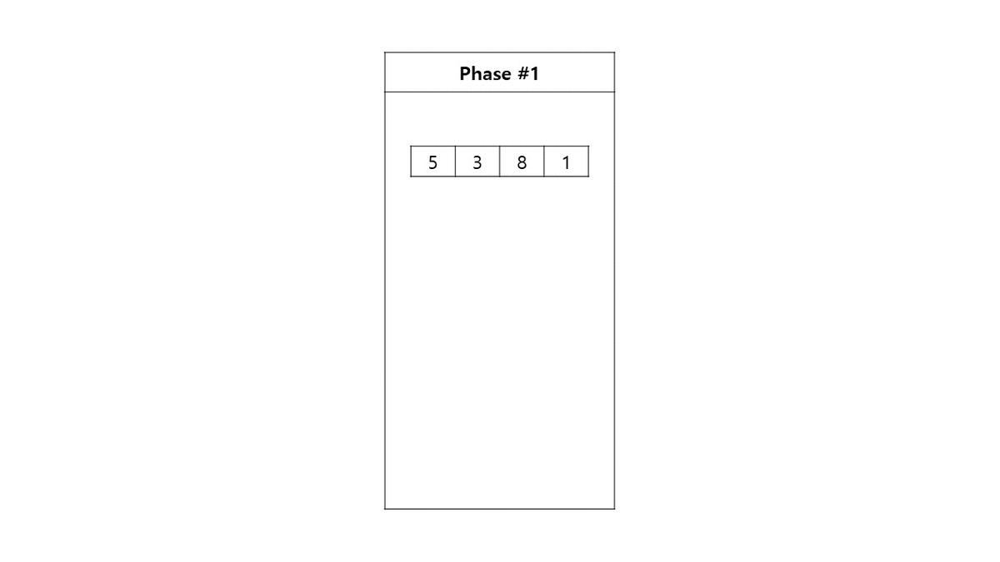
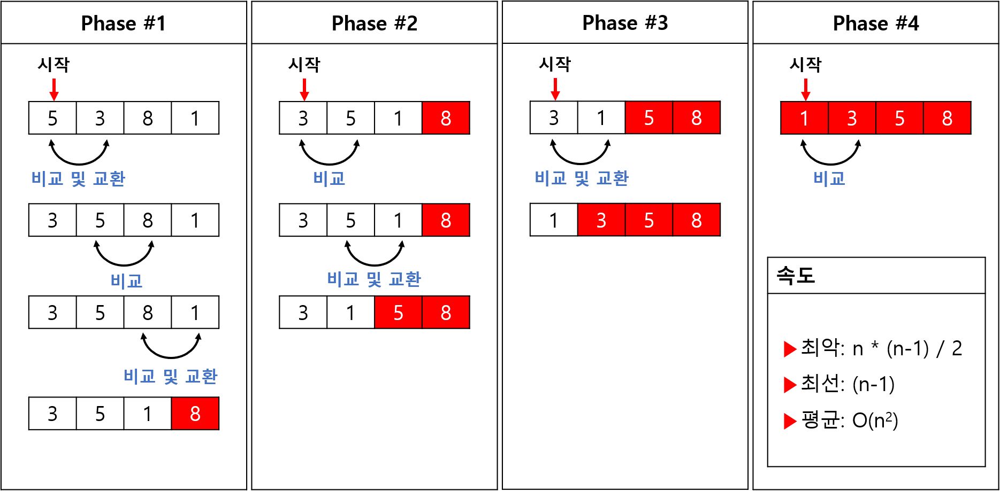

# 버블 정렬 ( Bubble Sort )

## 개념
### 요약

- 서로 인접한 두 원소를 검사하여 정렬하는 알고리즘
  - 인접한 2개의 레코드를 비교하여 크기가 순서대로 되어 있지 않으면 서로 교환한다.
- 선택 정렬과 기본 개념이 유사하다.

### 자세히

- 버블 정렬은 첫 번째 자료와 두 번째 자료를, 두 번째 자료와 세 번째 자료를, 세 번째와 네 번째를, … 이런 식으로 (마지막-1)번째 자료와 마지막 자료를 비교하여 교환하면서 자료를 정렬한다.
- **1회전을 수행하고 나면 가장 큰 자료가 맨 뒤로 이동하므로** 2회전에서는 맨 끝에 있는 자료는 정렬에서 제외되고, 2회전을 수행하고 나면 끝에서 두 번째 자료까지는 정렬에서 제외된다. 이렇게 정렬을 1회전 수행할 때마다 정렬에서 제외되는 데이터가 하나씩 늘어난다.

## 특징

### 장점
- 구현이 매우 간단하다.
### 단점
- 순서에 맞지 않은 요소를 인접한 요소와 교환한다.
- 하나의 요소가 가장 왼쪽에서 가장 오른쪽으로 이동하기 위해서는 배열에서 모든 다른 요소들과 교환되어야 한다.
- 특히 특정 요소가 최종 정렬 위치에 이미 있는 경우라도 교환되는 일이 일어난다.

일반적으로 자료의 교환 작업(SWAP)이 자료의 이동 작업(MOVE)보다 더 복잡하기 때문에 버블 정렬은 단순성에도 불구하고 **거의 쓰이지 않는다.**

## References
- https://gmlwjd9405.github.io/2018/05/06/algorithm-bubble-sort.html
- https://javaplant.tistory.com/16