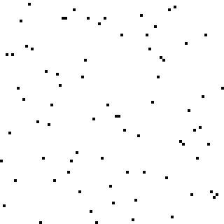

# 선택 정렬 ( Selection Sort )

> [이미지 출처 : Selection Sort Animation .wikimedia]

## 개념
### 요약

- 제자리 정렬(in-place sorting) 알고리즘의 하나
  - 입력 배열(정렬되지 않은 값들) 이외에 다른 추가 메모리를 요구하지 않는 정렬 방법
- 해당 순서에 원소를 넣을 위치는 이미 정해져 있고, 어떤 원소를 넣을지 선택하는 알고리즘
  - 첫 번째 순서에는 첫 번째 위치에 가장 최솟값을 넣는다.
  - 두 번째 순서에는 두 번째 위치에 남은 값 중에서의 최솟값을 넣는다.
- **과정 설명**
  1. 주어진 배열 중에서 최솟값을 찾는다.
  2. 그 값을 맨 앞에 위치한 값과 교체한다(패스(pass)).
  3. 맨 처음 위치를 뺀 나머지 리스트를 같은 방법으로 교체한다.
  4. 하나의 원소만 남을 때까지 위의 1~3 과정을 반복한다.

### 자세히

- 선택 정렬은 첫 번째 자료를 두 번째 자료부터 마지막 자료까지 차례대로 비교하여 가장 작은 값을 찾아 첫 번째에 놓고, 두 번째 자료를 세 번째 자료부터 마지막 자료까지와 차례대로 비교하여 그 중 가장 작은 값을 찾아 두 번째 위치에 놓는 과정을 반복하며 정렬을 수행한다.
- **1회전을 수행하고 나면 가장 작은 값의 자료가 맨 앞에 오게 되므로** 그 다음 회전에서는 두 번째 자료를 가지고 비교한다. 마찬가지로 3회전에서는 세 번째 자료를 정렬한다.

> [이미지 출처 : [gmlwjd9405.github.io](https://gmlwjd9405.github.io/2018/05/06/algorithm-selection-sort.html)]

## 특징

### 장점
- 자료 이동 횟수가 미리 결정된다.
- 데이터의 양이 적을 때 좋은 성능을 나타낸다.
- 작은 값을 선택하기 위해서 비교는 여러번 수행되지만 교환횟수가 적다.
### 단점
- 100개 이상의 자료에 대해서는 속도가 급격히 떨어져 적절히 사용되기 힘들다.
- 안정성을 만족하지 않는다.
- 즉, 값이 같은 레코드가 있는 경우에 상대적인 위치가 변경될 수 있다.
- 특히 특정 요소가 최종 정렬 위치에 이미 있는 경우라도 교환되는 일이 일어난다.

## References
- https://gmlwjd9405.github.io/2018/05/06/algorithm-selection-sort.html
- https://brunch.co.kr/@kjhwert11/15
- https://dpdpwl.tistory.com/17
- https://hahahoho5915.tistory.com/7
