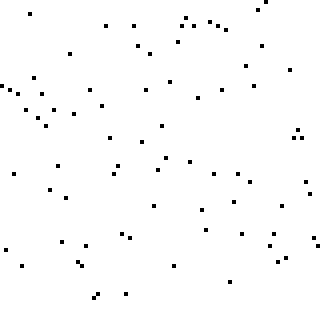
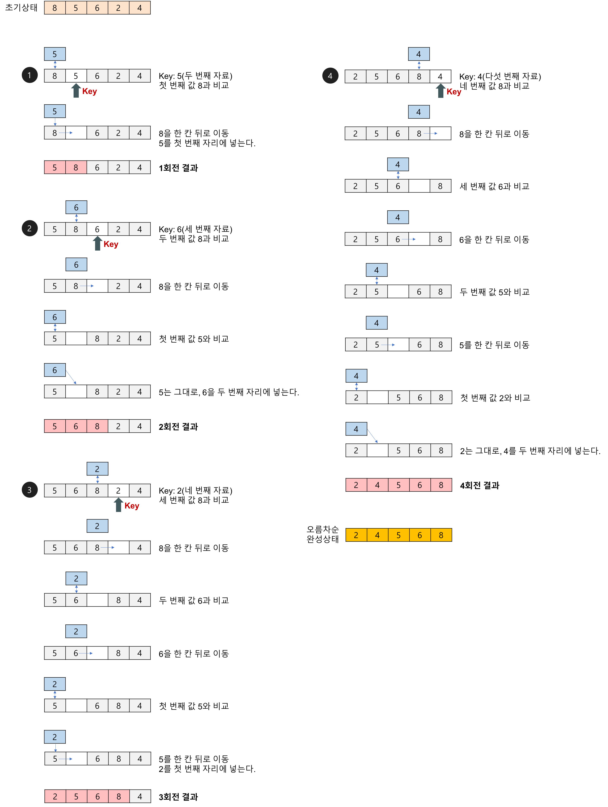

[:file_folder: **Algorithm List**](https://github.com/dlalstj0213/Study.Algorithm_Java)

[:arrow_backward: **BACK**](../)

---

# 삽입 정렬 ( Insertion Sort )

> [이미지 출처 : Insertion Sort Animation *.wikimedia*]

## 개념
### 요약

- 손안의 카드를 정렬하는 방법과 유사하다.
- 새로운 카드를 기존의 정렬된 카드 사이의 올바른 자리를 찾아 삽입한다.
- 새로 삽입될 카드의 수만큼 반복하게 되면 전체 카드가 정렬된다.
- 자료 배열의 모든 요소를 **앞에서부터 차례대로 이미 정렬된 배열 부분과 비교** 하여, 자신의 위치를 찾아 삽입함으로써 정렬을 완성하는 알고리즘
- 매 순서마다 해당 원소를 삽입할 수 있는 위치를 찾아 해당 위치에 넣는다.

### 자세히

- 삽입 정렬은 두 번째 자료부터 시작하여 그 앞(왼쪽)의 자료들과 비교하여 삽입할 위치를 지정한 후 자료를 뒤로 옮기고 지정한 자리에 자료를 삽입하여 정렬하는 알고리즘이다.
- 즉, 두 번째 자료는 첫 번째 자료, 세 번째 자료는 두 번째와 첫 번째 자료, 네 번째 자료는 세 번째, 두 번째, 첫 번째 자료와 비교한 후 자료가 삽입될 위치를 찾는다. 자료가 삽입될 위치를 찾았다면 그 위치에 자료를 삽입하기 위해 자료를 한 칸씩 뒤로 이동시킨다.
- **처음 Key 값은 두 번째 자료부터 시작한다.**

> [이미지 출처 : [gmlwjd9405.github.io](https://gmlwjd9405.github.io/2018/05/06/algorithm-insertion-sort.html)]

## 특징

### 장점
- 안정한 정렬 방법
- 레코드의 수가 적을 경우 알고리즘 자체가 매우 간단하므로 다른 복잡한 정렬 방법보다 유리할 수 있다.
- 대부분위 레코드가 이미 정렬되어 있는 경우에 매우 효율적일 수 있다.
- 최선의 경우 O(N)이라는 엄청나게 빠른 효율성을 가지고 있다.
- 성능이 좋아서 다른 정렬 알고리즘의 일부로 사용될 만큼 좋은 정렬법이다.

### 단점
- 비교적 많은 레코드들의 이동을 포함한다.
- 레코드 수가 많고 레코드 크기가 클 경우에 적합하지 않다.
- 최악의 경우 O(n²) 이라는 시간복잡도를 갖게된다. 즉, 데이터의 상태 및 데이터의 크기에 따라서 성능의 편차가 굉장히 심한 정렬법이다.

## References
- https://gmlwjd9405.github.io/2018/05/06/algorithm-insertion-sort.html
- https://brunch.co.kr/@kjhwert11/15
- https://marobiana.tistory.com/85
- https://dpdpwl.tistory.com/18
- https://yabmoons.tistory.com/250

---

[:arrow_up: **Top**](#)